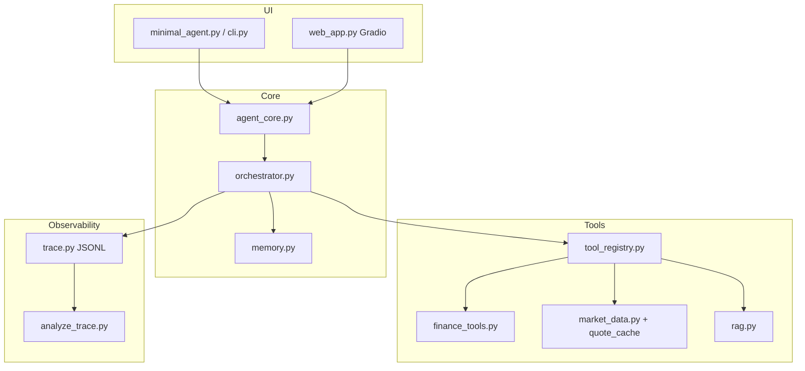

# FinAgent：可观测的智谱 GLM 金融 Tool-Use Agent

面向金融场景的 Tool-Use Agent：17 个确定性工具（复利/房贷/行情/组合/风险指标）+ 本地 BM25 RAG + JSONL 全链路 Trace + Gradio Web。

**仓库**：https://github.com/zihim-mok/GLM-tool-use-agent-with-local-RAG-and-trace-logging  


## 亮点

- **Tool-Use 多轮编排**：`orchestrator` 实现 GLM 工具调用闭环，CLI/Web 共用 `agent_core`
- **工具注册中心**：`tool_registry.py` + `@register_tool` 统一 schema 与 handler
- **全链路可观测**：`trace_id` + JSONL；`analyze_trace.py` 支持文本 / Mermaid / HTML 复盘
- **多级行情兜底 + TTL 缓存**：东财 → akshare → 腾讯证券 → 本地 CSV；同会话重复查询命中缓存
- **场景模式**：`educational` / `quick` / `portfolio` 三套系统提示
- **零向量 RAG**：jieba 分词 + BM25 风格打分，无 embedding API 依赖

## 架构



## 准备

1. Python 3.10+
2. 安装依赖（勿装 PyPI 占位包 `zai`，应装 `zai-sdk`）

```bash
cd demo_agent
python -m venv .venv
.\.venv\Scripts\activate
pip install -r requirements.txt
```

3. 复制 `.env.example` 为 `.env`，填入智谱 `ZHIPU_API_KEY`

## 运行

### 命令行

```bash
python minimal_agent.py
```

或指定场景模式：

```bash
python cli.py --mode portfolio
```

双击 **`run.bat`** 亦可。

### Web 页面（Gradio）

```bash
python web_app.py
```

或双击 **`run_web.bat`**，浏览器打开 `http://127.0.0.1:7860`

### Docker

```bash
docker compose up --build
```

访问 `http://localhost:7860`

## 内置工具（17）

| 类别 | 工具 |
|------|------|
| 通用 | `get_current_time`, `calculate`, `search_knowledge` |
| 理财计算 | `compound_interest`, `simple_interest`, `loan_monthly_payment`, `savings_goal_monthly` |
| 指标 | `pct_change`, `cagr`, `rule_of_72`, `inflation_adjust`, `sharpe_ratio`, `max_drawdown`, `bond_yield_estimate` |
| 行情/组合 | `lookup_quote`, `get_stock_history`, `get_fx_usdcny`, `compare_symbols`, `portfolio_summary` |

## 试试这些问题

- `600519 最近收盘价多少`
- `1 万本金年化 3% 按月复利存 5 年多少钱`
- `帮我看看示例组合盈亏`
- `夏普比率怎么理解？`
- `面值100、现价95、5年期、票面3%的债券 YTM 多少`

## 目录

| 文件 | 作用 |
|------|------|
| `tool_registry.py` | 工具注册装饰器 |
| `quote_cache.py` | 行情 TTL 缓存 |
| `tool_metadata.py` | 工具返回元数据 enrichment |
| `docs/trace_sample.jsonl` | 示例 trace |
| `docs/trace_example.txt` | analyze_trace 文本输出样例 |
| `docs/screenshots/` | 截图占位与说明 |
| `scripts/refresh_quotes.py` | 拉取近行情写入缓存 |

## 环境变量

见 `.env.example`：`SCENE_MODE`、`QUOTE_CACHE_TTL_SECONDS`、`GLM_MODEL` 等。

## 复盘 trace

```bash
python analyze_trace.py docs/trace_sample.jsonl
python analyze_trace.py logs/<trace_id>.jsonl --mermaid
python analyze_trace.py docs/trace_sample.jsonl --html report.html
```

### Trace 输出示例

```
trace_id: sample-trace-001
事件数: 9

01 2026-05-28T10:00:01  session_start
02 2026-05-28T10:00:02  user_message 600519 最近收盘价多少？
...
汇总: LLM 响应轮次=2 工具调用=1 工具总耗时=420ms
```

完整样例见 [docs/trace_example.txt](./docs/trace_example.txt)。

## 截图与演示

将 Web 界面截图放入 `docs/screenshots/`（见 [docs/screenshots/README.md](./docs/screenshots/README.md)）。

建议文件：`web_chat.png`、`web_tools_panel.png`、`demo.gif`

## 测试

```bash
pytest tests/ -v
```

CI：`.github/workflows/test.yml`（无需 API Key）

## 试试 RAG

在 `knowledge/` 里编辑或新增 `.md`，然后提问例如：「复利和单利有什么区别？」「什么是可转债？」
